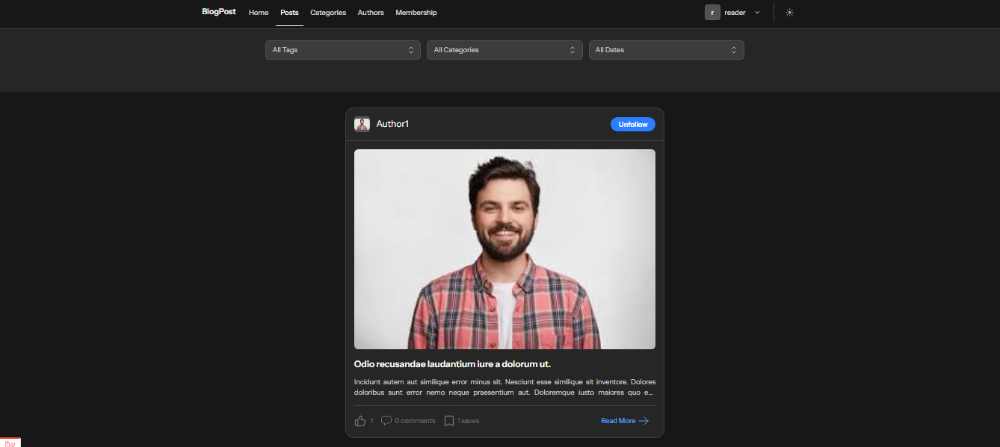
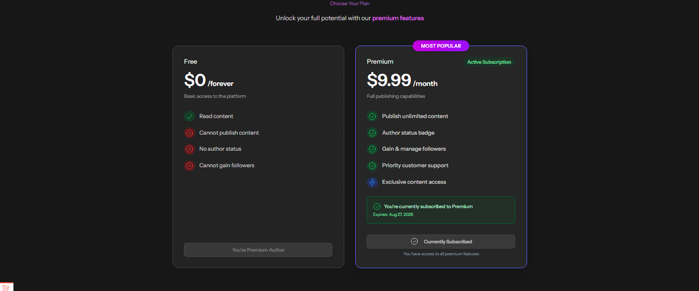

# Social Blogging Platform (TALL Stack)

<p align="center">
  
  
</p>


[](https://laravel.com)
[](https://livewire.laravel.com)
[](https://tailwindcss.com)
[](https://alpinejs.dev)
[](https://www.php.net)
[](https://stripe.com)
[](https://github.com/MahmoudSalah53/BlogPost/stargazers)

A comprehensive content management platform built with the TALL stack (Tailwind CSS, Alpine.js, Laravel, Livewire) featuring role-based access control, subscription management, and analytics dashboard.

---

## 🛠️ Tech Stack

| Technology     | Version | Purpose                    |
|----------------|---------|----------------------------|
| **Laravel**    | 12.x    | Backend Framework          |
| **Livewire**   | 3.0     | Full-stack Framework       |
| **Alpine.js**  | Latest  | JavaScript Framework       |
| **Tailwind CSS** | 3.x   | CSS Framework              |
| **Filament**   | 3.0     | Admin Panel                |
| **Stripe**     | Latest  | Payment Processing         |
| **Flux UI**    | Latest  | UI Components              |

---

## ✨ Key Features

### 🔐 Role-Based Access Control
- **👨‍💼 Admin Panel** – Complete system administration with analytics dashboard
- **✍️ Author Panel** – Content creation and management tools
- **👥 Reader Panel** – Content consumption and user interaction

### 📝 Content Management System
- **📄 Post Publishing** – Create, edit, and publish articles with rich editing
- **💬 Engagement System** – Like, save, and comment functionality
- **👤 Author Following** – Build communities around content creators

### 📊 Analytics & Reporting
- **📈 Visual Dashboard** – Interactive charts and real-time metrics
- **💰 Revenue Tracking** – Comprehensive financial analytics
- **👥 User Metrics** – Detailed engagement and behavior insights

### 💳 Subscription Management
- **🔒 Stripe Integration** – Secure, PCI-compliant payment processing
- **⏰ Time-based Access** – Flexible subscription duration controls
- **🛡️ Admin Oversight** – Complete subscription lifecycle management

---

## 📋 System Requirements

| Requirement        | Version   |
|--------------------|-----------|
| **PHP**            | 8.3+      |
| **Laravel**        | 12.x      |
| **Composer**       | Latest    |
| **Node.js & NPM**  | Latest LTS|
| **Database**       | MySQL 8.0+|

---

## 🚀 Quick Start Installation

### Step 1: Clone & Setup
```bash
git clone https://github.com/MahmoudSalah53/BlogPost.git
cd BlogPost

composer install
npm install
```


### Step 2: Environment Configuration
```bash
cp .env.example .env
php artisan key:generate
```


### Step 3: Database Setup
```bash
php artisan migrate --seed
php artisan storage:link
```


### Step 4: Build & Launch
```bash
npm run dev
php artisan serve
```


### 🔧 Stripe Payment Setup
Add the following to your .env file:
```env
STRIPE_KEY=pk_test_your_stripe_publishable_key
STRIPE_SECRET=sk_test_your_stripe_secret_key
STRIPE_WEBHOOK_SECRET=whsec_your_webhook_secret_key
```
### 📂 Storage Setup
Run the following command to create the storage symlink:
```bash
php artisan storage:link
```


💡 Tip: Use test keys for development. Replace with live keys for production.


## 📱 Platform Usage
### 👨‍💼 Admin Dashboard
- 📊 Analytics Overview

- 👥 User Management

- 📝 Content Moderation

- 💰 Subscription Monitoring

### ✍️ Author Panel
- 📝 Rich Post Creation

- 📈 Performance Metrics

- 👥 Audience Interaction

### 👥 Reader Interface
- 🔍 Content Discovery

- 💬 Post Interactions (like, save, comment)

- 👤 Follow Authors

- 💳 Manage Subscriptions

## 👥 Contributors
Developed collaboratively by:

[Mahmoud Salah](https://github.com/MahmoudSalah53)

[Khaled Abdalah](https://github.com/khaledAbdalah)

## 🐛 Support & Issues
Have a bug or feature request?

- 🐞 Open an Issue

- 🌟 Star the Repo

- 🍴 Fork This Project

